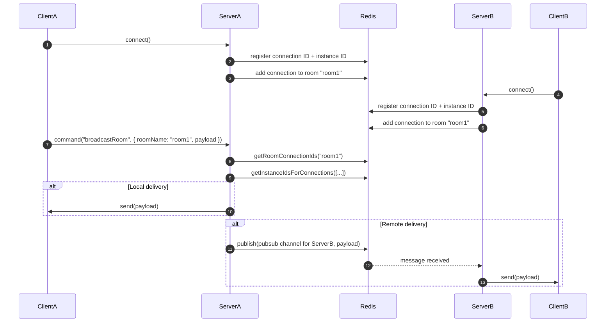

# mesh

Mesh is a command-based WebSocket framework for real-time applications. It uses Redis to coordinate connections, rooms, presence, and shared state across application instances, with built-in support for structured commands, latency tracking, and automatic reconnection.

* [Quickstart](#quickstart)
  * [Server](#server)
  * [Client](#client)
  * [Next steps](#next-steps)
* [Who is this for?](#who-is-this-for)
* [Distributed messaging architecture](#distributed-messaging-architecture)
* [Redis channel subscriptions](#redis-channel-subscriptions)
  * [Server configuration](#server-configuration)
  * [Server publishing](#server-publishing)
  * [Client usage](#client-usage)
* [Rooms](#rooms)
  * [Joining a room](#joining-a-room)
  * [Leaving a room](#leaving-a-room)
  * [Server API](#server-api)
  * [Access control](#access-control)
* [Presence](#presence)
  * [Server configuration](#server-configuration-1)
  * [Client usage](#client-usage-1)
  * [Getting presence information (server-side)](#getting-presence-information-server-side)
  * [Disabling auto-cleanup (optional)](#disabling-auto-cleanup-optional)
  * [Combining presence with user info](#combining-presence-with-user-info)
  * [Presence is per connection, not per user](#presence-is-per-connection-not-per-user)
  * [Presence state](#presence-state)
    * [Client API](#client-api)
    * [Server behavior](#server-behavior)
    * [Receiving presence state updates](#receiving-presence-state-updates)
  * [Metadata](#metadata)
  * [Room metadata](#room-metadata)
* [Record subscriptions](#record-subscriptions)
  * [Server configuration](#server-configuration-2)
  * [Server configuration (writable)](#server-configuration-writable)
  * [Updating records (server-side)](#updating-records-server-side)
  * [Updating records (client-side)](#updating-records-client-side)
  * [Client usage — full mode (default)](#client-usage--full-mode-default)
  * [Client usage — patch mode](#client-usage--patch-mode)
  * [Unsubscribing](#unsubscribing)
  * [Versioning and resync](#versioning-and-resync)
  * [Why you probably don't need client-side diffing](#why-you-probably-dont-need-client-side-diffing)
* [Command middleware](#command-middleware)
* [Latency tracking and connection liveness](#latency-tracking-and-connection-liveness)
  * [Server-side configuration](#server-side-configuration)
  * [Client-side configuration](#client-side-configuration)
* [Comparison](#comparison)

## Quickstart

```bash
npm install @prsm/mesh
```

Here's the fastest way to get a server and client connected.

### Server

```ts
import { MeshServer } from "@prsm/mesh/server";

const server = new MeshServer({
  port: 8080,
  redisOptions: { host: "localhost", port: 6379 },
});

server.exposeCommand("echo", async (ctx) => {
  return `echo: ${ctx.payload}`;
});
```

### Client

```ts
import { MeshClient } from "@prsm/mesh/client";

const client = new MeshClient("ws://localhost:8080");
await client.connect();

const response = await client.command("echo", "Hello!");
console.log(response); // "echo: Hello!"
```

### Next steps

Mesh supports multiple real-time patterns—choose where to go next based on your use case:

- **Pub/Sub messaging (e.g. chat, notifications):**
  → [Redis channel subscriptions](#redis-channel-subscriptions)

- **Real-time presence tracking (e.g. who's online, who's in what room):**
  → [Presence](#presence)

- **Granular, versioned data sync (e.g. user profiles, dashboards):**
  → [Record subscriptions](#record-subscriptions)

- **Identify users, store connection info, or manage rooms:**  
  → [Metadata](#metadata) and [Room metadata](#room-metadata)

- **Control access or validate inputs across commands:**  
  → [Command middleware](#command-middleware)

- **Use Mesh with an existing Express server:**  
  → [@prsm/mesh-express](https://github.com/nvms/prsm/tree/main/packages/mesh-express)

Want to see how messages flow across servers?  
→ [Distributed messaging architecture](#distributed-messaging-architecture)

## Who is this for?

The 95% of real-world apps that need real-time sync—but don't want to build their own protocol, state engine, or distributed infrastructure. If you're building something like the examples below, Mesh is probably a great fit:

**Collaborative apps**

- Live cursors
- Shared whiteboards or form editors
- Session co-browsing

**Dashboards and control panels**

- IoT device dashboards
- Live analytics or system monitors
- Stock tickers

**Real-time social features**

- Chat, presence indicators
- Typing indicators
- Notification feeds

**Turn-based or async games**

- Multiplayer puzzles
- Card games
- Structured multiplayer game state (e.g. inventories, turns, positions, shared resources)

## Distributed messaging architecture

The diagram below shows how Mesh handles communication in a distributed setup. It uses Redis to track which connections belong to which rooms, determine their host servers, and route messages either locally or across servers via pub/sub.



## Redis channel subscriptions

Mesh lets clients subscribe to Redis pub/sub channels and receive messages directly over their WebSocket connection. When subscribing, clients can optionally request recent message history.

### Server configuration

Expose the channels you want to allow subscriptions to:

```ts
server.exposeChannel("notifications:global");
server.exposeChannel(/^chat:.+$/);

// return false to disallow subscription, or true to allow
server.exposeChannel(/^private:chat:.+$/, async (conn, channel) => {
  // per-client guarding
  const valid = await isPremiumUser(conn);
  return valid;
});
```

### Server publishing

To publish messages to a channel (which subscribed clients will receive), use the `publishToChannel` method. You can optionally store a history of recent messages in Redis.

```ts
// publish to 'notifications:global' without history
await server.publishToChannel(
  "notifications:global",
  JSON.stringify({ alert: "Red alert!" })
);

// publish a chat message and keep the last 50 messages in history
await server.publishToChannel(
  "chat:room1",
  JSON.stringify({ type: "user-message", user: "1", text: "Hi" }),
  50 // store in Redis history
);
```

The `history` parameter tells Mesh to store the message in a Redis list (`history:<channel>`) and trim the list to the specified size, ensuring only the most recent messages are kept. Clients subscribing with the `historyLimit` option will receive these historical messages upon connection.

### Client usage

```ts
const { success, history } = await client.subscribeChannel(
  "chat:room1",
  (message) => {
    console.log("Live message:", message);
  },
  { historyLimit: 3 }
);

if (success) {
  console.log("Recent messages:", history); // ["msg3", "msg2", "msg1"]
}
```

Unsubscribe when no longer needed:

```ts
await client.unsubscribeChannel("chat:room1");
```

This feature is great for:

- Real-time chat and collaboration
- Live system dashboards
- Pub/sub messaging across distributed server instances
- Notification feeds with instant context

## Rooms

Mesh supports rooms as a first-class concept for organizing connections into logical groups. Clients can join and leave rooms using simple built-in commands.

Room membership is automatically tracked across server instances using Redis, and cleaned up when connections disconnect.

### Joining a room

Use the `joinRoom` method on the client:

```ts
const { success, present } = await client.joinRoom("room:lobby");
```

By default, this joins the room without subscribing to presence.

To automatically receive presence updates when users join or leave:

```ts
const { success, present } = await client.joinRoom("room:lobby", (update) => {
  if (update.type === "join") {
    console.log("User joined:", update.connectionId);
  } else {
    console.log("User left:", update.connectionId);
  }
});
```

This behaves identically to calling `subscribePresence(...)` yourself, but is more convenient. The `present` array includes the list of currently connected users at the time of join.

> [!NOTE]
> If you don’t pass a callback, the `present` array still reflects who is currently in the room — even though no real-time presence tracking is active.

### Leaving a room

Call `leaveRoom(...)` to exit the room:

```ts
await client.leaveRoom("room:lobby");
```

If presence was subscribed via `joinRoom(...)`, it will automatically be unsubscribed when leaving.

This ensures room and presence subscriptions remain in sync without extra work.

### Server API

Mesh also exposes room utilities on the server for custom behavior:

- `server.addToRoom(roomName, connection)`
- `server.removeFromRoom(roomName, connection)`
- `server.isInRoom(roomName, connection)` → `boolean`
- `server.getRoomMembers(roomName)` → `string[]`
- `server.removeFromAllRooms(connection)`
- `server.clearRoom(roomName)`

These can be used to implement custom commands or manage room state manually if needed.

### Access control

You can guard room joins using command middleware, just like any other command. The built-in room join command is "mesh/join-room", and the payload contains a `roomName` string:

```ts
server.useMiddleware(async (ctx) => {
  if (ctx.command === "mesh/join-room") {
    const { roomName } = ctx.payload;
    const meta = await server.connectionManager.getMetadata(ctx.connection);

    if (!meta?.canJoinRooms) {
      throw new Error("Access denied");
    }

    if (roomName.startsWith("admin:") && !meta.isAdmin) {
      throw new Error("Admins only");
    }
  }
});
```

This gives you full flexibility to enforce auth, roles, or custom logic per room.

## Presence

Mesh provides a built-in presence system that tracks which connections are present in specific rooms and notifies clients when connections join or leave. This is ideal for building features like "who's online" indicators, or any real-time awareness of other users.

> [!NOTE]
> Presence only tracks _connection IDs_, not metadata. You must join them explicitly if you want to show e.g. usernames, avatars, emails, etc.

### Server configuration

Enable presence tracking for specific rooms using exact names or regex patterns. You can optionally customize the TTL or restrict access with a guard.

```ts
// track presence for all rooms matching a pattern
server.trackPresence(/^room:.*$/);

// track presence for a specific room with a custom TTL
server.trackPresence("game-room", {
  ttl: 60_000, // time in ms before presence entry expires if not refreshed
});

// restrict visibility to admins
server.trackPresence("admin-room", {
  guard: async (conn, roomName) => {
    const meta = await server.connectionManager.getMetadata(conn);
    return meta?.isAdmin === true;
  },
});
```

When presence tracking is enabled:

- Mesh stores connection IDs in Redis with a TTL
- As long as a client remains active, the TTL is automatically refreshed
- When the TTL expires (e.g. due to disconnect or inactivity), Mesh **automatically marks the connection offline** and emits a `leave` event

> [!INFO]
> Under the hood, this uses Redis keyspace notifications to detect expiration events and trigger cleanup. This behavior is enabled by default and can be disabled via the `enablePresenceExpirationEvents` server option.

### Client usage

Subscribe to presence updates:

```ts
const { success, present } = await client.subscribePresence(
  "room:lobby",
  (update) => {
    if (update.type === "join") {
      console.log("User joined:", update.connectionId);
    } else if (update.type === "leave") {
      console.log("User left:", update.connectionId);
    }
  }
);

// initial list of present connections
console.log("Currently present:", present); // ["conn1", "conn2", ...]
```

You'll receive:

- The current list of `connectionId`s as `present`
- Real-time `"join"` and `"leave"` events as users come and go (or TTL expires)

Unsubscribe when done:

```ts
await client.unsubscribePresence("room:lobby");
```

### Getting presence information (server-side)

```ts
const ids = await server.presenceManager.getPresentConnections("room:lobby");
// ["abc123", "def456", ...]
```

### Disabling auto-cleanup (optional)

If for some reason you don't want TTL expirations to trigger `leave` events, you can disable it in your `MeshServer` options:

```ts
const server = new MeshServer({
  port: 8080,
  redisOptions: { host: "localhost", port: 6379 },
  enablePresenceExpirationEvents: false,
});
```

This disables Redis keyspace notifications and requires you to manage stale connections yourself (not recommended).

### Combining presence with user info

Presence is most useful when combined with connection metadata. For example:

```ts
// server: set user metadata when they connect
server.onConnection(async (connection) => {
  // maybe from an auth token or session
  await server.connectionManager.setMetadata(connection, {
    userId: "user123",
    username: "Alice",
    avatar: "https://example.com/avatar.png",
  });
});
```

Then on the client:

```ts
const { success, present } = await client.subscribePresence(
  "lobby",
  async (update) => {
    const metadata = await client.command("get-user-metadata", {
      connectionId: update.connectionId,
    });

    if (update.type === "join") {
      console.log(`${metadata.username} joined the lobby`);
    } else if (update.type === "leave") {
      console.log(`${metadata.username} left the lobby`);
    }
  }
);
```

To resolve all present users:

```ts
const allMetadata = await Promise.all(
  present.map((connectionId) =>
    client.command("get-user-metadata", { connectionId })
  )
);

// [{ userId: "user123", username: "Alice", avatar: "..." }, ...]
```

### Presence is per connection, not per user

Mesh tracks presence and presence state **per connection**, not per user.

When a user opens your app in multiple browser tabs or across multiple devices, each instance creates a separate WebSocket connection. These connections are treated independently in Mesh, each with its own connection ID, room membership, and presence state.

Even if those connections authenticate using the same user ID and you store that user ID in connection metadata, Mesh will not automatically group or deduplicate them. Each connection remains logically distinct.

This is intentional. Mesh is designed as a low-level framework that gives you real-time building blocks — like rooms, presence, state sync, and messaging — without dictating your data model, authentication flow, or application logic.

We don’t assume what a "user" is in your system, how they should be identified, or whether multiple sessions should be merged. That’s entirely up to you.

If you want to implement user-level presence behavior (such as "only show one typing indicator per user"), you can do so easily:

1. Assign a `userId` to each connection’s metadata during authentication.
2. On the client, resolve metadata for each `connectionId` received in presence events.
3. In your UI, deduplicate by `userId` rather than `connectionId`.

This gives you full control over what “presence” means in your app, without locking you into a particular structure.

> [!TIP]
> You can expose a `get-user-metadata` command on the server that reads from `connectionManager.getMetadata(...)` to support this.

### Presence state

In addition to tracking who is present in a room, Mesh lets clients publish **custom ephemeral presence states** — things like `"typing"`, `"away"`, `"drawing"`, etc.

Presence states are:

- Scoped per connection, per room
- Completely defined by your app (no built-in types)
- Optionally ephemeral via client-defined expiration
- Broadcast to all clients subscribed to presence in that room

> [!NOTE]
> Presence states are separate from connection metadata. States are transient and lightweight.

#### Client API

To publish a presence state:

```ts
await client.publishPresenceState("room:lobby", {
  state: { status: "typing", field: "title" },
  expireAfter: 8000, // optional (ms)
});
```

To clear the state manually before it expires:

```ts
await client.clearPresenceState("room:lobby");
```

#### Server behavior

- The state is stored in Redis under  
  `mesh:presence:state:{room}:{connectionId}`
- If `ts expireAfter ` is set, it’s stored with a TTL (using Redis PX)
- If the key expires:
  - The state is deleted
  - A `ts { type: "state", state: null } ` event is broadcast to subscribed clients so they can do any necessary UI updates
- If the client clears it manually, the same event is emitted immediately
- If the client leaves the room or disconnects, their state is cleared

#### Receiving presence state updates

Clients already using `ts subscribePresence(...) ` will receive `state` updates:

```ts
const { success, present, states } = await client.subscribePresence(
  "room:lobby",
  (update) => {
    if (update.type === "state") {
      if (update.state) {
        console.log(`${update.connectionId} is now`, update.state);
      } else {
        console.log(`${update.connectionId}'s state was cleared`);
      }
    }
  }
);
```

The `ts states ` object includes the currently active presence states at the time of subscription.

Example:

```ts
{
  "abc123": { status: "typing", field: "title" },
  "def456": { status: "away" }
}
```

> [!TIP]
> This is a low-level signaling primitive. You decide what presence states mean in your app. Mesh just relays and cleans them up.

### Metadata

You can associate data like user IDs, tokens, or custom attributes with a connection using the `setMetadata` method. This metadata is stored in Redis, making it ideal for identifying users, managing permissions, or persisting session-related data across a distributed setup. Since it lives in Redis, it’s accessible from any server instance.

Metadata can be any JSON-serializable object, including nested structures. Updates fully replace the previous value—partial updates (patches) are not supported. While there is no hard size limit, large metadata objects may impact Redis performance.

```ts
server.exposeCommand("authenticate", async (ctx) => {
  // maybe do some actual authentication here
  const { userId } = ctx.payload;
  const token = encode({
    sub: userId,
    iat: Date.now(),
    exp: Date.now() + 3600,
  });

  await server.connectionManager.setMetadata(ctx.connection, {
    userId,
    token,
  });

  return { success: true };
});
```

Get metadata for a specific connection:

```ts
const metadata = await server.connectionManager.getMetadata(connectionId);
// { userId, token }
```

Get all metadata for all connections:

```ts
const metadata = await server.connectionManager.getAllMetadata();
// [{ [connectionId]: { userId, token } }, ...]
```

Get all metadata for all connections in a specific room:

```ts
const metadata = await server.connectionManager.getAllMetadataForRoom(roomName);
// [{ [connectionId]: { userId, token } }, ...]
```

### Room metadata

Similar to connection metadata, Mesh allows you to associate arbitrary data with rooms. This is useful for storing room-specific information like topics, settings, or ownership details. Room metadata is also stored in Redis and accessible across all server instances.

Room metadata can also be any JSON-serializable object. Updates replace the entire object—partial merges only occur when using updateMetadata, which shallowly merges the new fields. Like connection metadata, there’s no enforced size limit, but keeping room metadata small is recommended for performance.

```ts
// set metadata for a room
await server.roomManager.setMetadata("lobby", {
  topic: "General Discussion",
  maxUsers: 50,
});

// get metadata for a specific room
const lobbyMeta = await server.roomManager.getMetadata("lobby");
// { topic: "General Discussion", maxUsers: 50 }

// update metadata (merges with existing data)
await server.roomManager.updateMetadata("lobby", {
  topic: "Updated Topic", // overwrites existing topic
  private: false, // adds new field
});

const updatedLobbyMeta = await server.roomManager.getMetadata("lobby");
// { topic: "Updated Topic", maxUsers: 50, private: false }

// get metadata for all rooms
const allRoomMeta = await server.roomManager.getAllMetadata();
// { lobby: { topic: "Updated Topic", maxUsers: 50, private: false }, otherRoom: { ... } }
```

Room metadata is removed when `clearRoom(roomName)` is called.

## Record subscriptions

Mesh supports subscribing to individual records stored in Redis. When a record changes, clients receive either the full value or a JSON patch describing the update—depending on the selected mode (`full` or `patch`).

Subscriptions work across multiple server instances, support versioning for consistency, and scale efficiently. Each client can choose its preferred mode independently.

### Server configuration

Expose records using exact IDs or regex patterns. You can add optional per-client guard logic:

```ts
server.exposeRecord("user:123");

server.exposeRecord(/^product:\d+$/);

server.exposeRecord(/^private:.+$/, async (conn, recordId) => {
  const meta = await server.connectionManager.getMetadata(conn);
  return !!meta?.userId;
});
```

### Server configuration (writable)

To allow clients to _subscribe_ and also _modify_ records, use `exposeWritableRecord`. This also accepts optional guard functions to control _write_ access:

```ts
// allow any connected client to write to cursor records
server.exposeWritableRecord(/^cursor:user:\d+$/);

// allow only authenticated users to write to their profile
server.exposeWritableRecord(/^profile:user:\d+$/, async (conn, recordId) => {
  const meta = await server.connectionManager.getMetadata(conn);
  const recordUserId = recordId.split(":").pop();
  return meta?.userId === recordUserId; // check if user ID matches record ID
});
```

**Important:** Records exposed via `exposeWritableRecord` are automatically readable (subscribable) by clients. You don't need to call `exposeRecord` for the same pattern. However, if you want different guards for reading and writing, you can expose the same pattern with both methods, each with its own guard.

### Updating records (server-side)

Use `publishRecordUpdate()` from the server to update the stored value, increment the version, generate a patch, and broadcast to all subscribed clients (both read-only and writable).

```ts
await server.publishRecordUpdate("user:123", {
  name: "Alice",
  email: "alice@example.com",
});

// later...
await server.publishRecordUpdate("user:123", {
  name: "Alice",
  email: "alice@updated.com",
  status: "active",
});
```

### Updating records (client-side)

If a record has been exposed as writable via `exposeWritableRecord` on the server (and any guard function passes), clients can publish updates using the `publishRecordUpdate` method:

```ts
const userId = "123";
const success = await client.publishRecordUpdate(`cursor:user:${userId}`, {
  x: 100,
  y: 250,
  timestamp: Date.now(),
});

if (success) {
  console.log("Cursor position updated successfully.");
} else {
  console.error("Failed to update cursor position (maybe permission denied?).");
}
```

This client-initiated update will be processed by the server, which then uses the same `publishRecordUpdate` mechanism internally to persist the change and broadcast it (as a full value or patch) to all other subscribed clients. The method returns `true` if the server accepted the write, and `false` if it was rejected (e.g., due to a failed guard).

**Note:** When a client publishes an update to a record using `publishRecordUpdate`, it will also receive that update through its subscription callback just like any other client. This ensures consistency and simplifies update handling. If your app logic already applies local updates optimistically, you may choose to ignore redundant self-updates in your callback.

> [!NOTE]  
> When a client publishes an update to a record using publishRecordUpdate, it will also receive the resulting update through its own subscription callback—just like any other client. This ensures consistency and avoids special-casing updates based on origin.
>
> This behavior is always true, unless the client unsubscribed from the record before the update was broadcast. If your client logic applies optimistic updates locally, you may choose to ignore the echoed update if it's redundant.

### Client usage — full mode (default)

In `full` mode, the client receives the entire updated record every time. This is simpler to use and ideal for small records or when patching isn't needed.

```ts
let userProfile = {};

const { success, record, version } = await client.subscribeRecord(
  "user:123",
  (update) => {
    // update contains { recordId, full, version }
    userProfile = update.full;
    console.log(
      `Received full update for ${update.recordId} v${update.version}:`,
      update.full
    );
  }
);

if (success) {
  userProfile = record;
}
```

### Client usage — patch mode

In `patch` mode, the client receives only changes as JSON patches and must apply them locally. This is especially useful for large records that only change in small ways over time.

> [!NOTE]  
> Patch mode only works for records that are **objects or arrays**.
> Primitive values like strings, numbers, or booleans aren't representable as JSON patches, so you should use full mode for those cases.

```ts
import { applyPatch } from "@prsm/mesh/client";

let productData = {};

const { success, record, version } = await client.subscribeRecord(
  "product:456",
  (update) => {
    // update contains { recordId, patch?, full?, version }
    if (update.patch) {
      // normally you’ll receive `patch`, but if the client falls out of sync,
      // the server will send a full update instead to resynchronize.
      applyPatch(productData, update.patch);
      console.log(`Applied patch for ${update.recordId} v${update.version}`);
    } else {
      productData = update.full;
      console.log(
        `Received full (resync) for ${update.recordId} v${update.version}`
      );
    }
  },
  { mode: "patch" }
);

if (success) {
  productData = record;
}
```

### Unsubscribing

```ts
await client.unsubscribeRecord("user:123");
await client.unsubscribeRecord("product:456");
```

### Versioning and resync

Every update includes a `version`. Clients track the current version and, in `patch` mode, expect `version === localVersion + 1`. If a gap is detected (missed patch), the client will automatically be sent a full record update to resync. It does this by transparently unsubscribing and resubscribing to the record.

This system allows fine-grained, real-time synchronization of distributed state with minimal overhead.

### Why you probably don't need client-side diffing

Some of this was mentioned above, but to reiterate:

Mesh handles all diffing on the server.

When you update a record - whether from the server or a client - the server:

1. Applies the new value
2. Computes a JSON patch between the old and new values.
3. Broadcasts the patch (or full value if needed) to all subscribed clients.
4. Increments and attaches a version number.

Clients simply apply the patch. If any patch is missed (e.g. due to disconnect or version mismatch), the server automatically sends a full record to resynchronize the client.

**This means:**

- Clients don't generate diffs.
- Clients don't compare old vs. new data.
- You never need to guess what changed.

All you do is apply the update you receive.

This makes real-time sync easier, safer, and dramatically more scalable—no complex client logic or custom diffing is required.

## Command middleware

Mesh allows you to define middleware functions that run before your command handlers. This is useful for tasks like authentication, validation, logging, or modifying the context before the main command logic executes.

Middleware can be applied globally to all commands or specifically to individual commands.

**Global Middleware:**

Applied to every command received by the server.

```ts
server.useMiddleware(async (ctx) => {
  console.log(`Received command: ${ctx.command} from ${ctx.connection.id}`);
});

server.useMiddleware(async (ctx) => {
  const metadata = await server.connectionManager.getMetadata(ctx.connection);
  if (!metadata?.userId) {
    throw new Error("Unauthorized");
  }

  // add to context for downstream handler access
  ctx.user = { id: metadata.userId };
});
```

**Command-Specific Middleware:**

Applied only to the specified command, running _after_ any global middleware.

```ts
const validateProfileUpdate = async (ctx) => {
  const { name, email } = ctx.payload;
  if (typeof name !== "string" || name.length === 0) {
    throw new Error("Invalid name");
  }
  if (typeof email !== "string" || !email.includes("@")) {
    throw new Error("Invalid email");
  }
};

server.exposeCommand(
  "update-profile",
  async (ctx) => {
    // ..
    return { success: true };
  },
  [validateProfileUpdate]
);
```

Middleware functions receive the same `MeshContext` object as command handlers and can be asynchronous. If a middleware function throws an error, the execution chain stops, and the error is sent back to the client.

## Latency tracking and connection liveness

Mesh includes a built-in ping/pong system to track latency and detect dead connections. This is implemented at the _application level_ (not via raw WebSocket protocol `ping()` frames) to allow for:

- Accurate round-trip latency measurement from server to client.
- Graceful connection closure and multi-instance Redis cleanup.
- Fine-tuned control using configurable missed ping/pong thresholds.

### Server-side configuration

By default, the server sends periodic `ping` commands. Clients respond with `pong`. If the server misses more than `maxMissedPongs` consecutive responses, the connection is considered stale and is closed cleanly. This ensures all connection metadata and room membership are safely cleaned up across distributed instances.

You can configure the server like so:

```ts
const server = new MeshServer({
  port: 8080,
  redisOptions: { host: "localhost", port: 6379 },
  pingInterval: 30000, // ms between ping commands
  latencyInterval: 5000, // ms between latency checks
  maxMissedPongs: 1, // how many consecutive pongs can be missed before closing (default: 1)
});
```

With the default `maxMissedPongs` value of 1, a client has roughly 2 \* pingInterval time to respond before being disconnected.

### Client-side configuration

On the client, Mesh automatically handles incoming `ping` commands by responding with a `pong`, and resets its internal missed pings counter. If the server stops sending `ping` messages (e.g. due to a dropped connection), the client will increment its missed pings counter. Once the counter exceeds `maxMissedPings`, the client will attempt to reconnect if `shouldReconnect` is enabled.

Client-side configuration looks like this:

```ts
const client = new MeshClient("ws://localhost:8080", {
  pingTimeout: 30000, // ms between ping timeout checks - should match the server's pingInterval
  maxMissedPings: 1, // how many consecutive pings can be missed before reconnecting (default: 1)
  shouldReconnect: true, // auto-reconnect when connection is lost
  reconnectInterval: 2000, // ms between reconnection attempts
  maxReconnectAttempts: 5, // give up after 5 tries (or Infinity by default)
});
```

Together, this system provides end-to-end connection liveness guarantees without relying on low-level WebSocket protocol `ping`/`pong` frames, which do not offer cross-instance cleanup or latency tracking. The configurable thresholds on both sides allow for fine-tuning the balance between responsiveness and tolerance for network latency.

## Comparison

|                          | **Mesh**                 | Socket.IO                       | Colyseus            | Deepstream.io   | ws (+ custom)        | uWebSockets.js          |
| ------------------------ | ------------------------ | ------------------------------- | ------------------- | --------------- | -------------------- | ----------------------- |
| **Command API (RPC)**    | ✅                       | ❌                              | ✅                  | ✅              | ❌                   | ❌                      |
| **Raw Events Support**   | ✅                       | ✅                              | ⚠️ Limited          | ✅              | ✅                   | ✅                      |
| **Room Support**         | ✅                       | ✅                              | ✅                  | ✅              | ⚠️ DIY               | ⚠️ Manual               |
| **Presence Tracking**    | ✅ Built-in              | ⚠️ Manual                       | ✅                  | ✅              | ❌                   | ❌                      |
| **Presence State**       | ✅ Client-defined        | ❌                              | ❌                  | ⚠️ Records      | ❌                   | ❌                      |
| **Presence Expiration**  | ✅ TTL + silent cleanup  | ⚠️ Manual                       | ❌                  | ❌              | ❌                   | ❌                      |
| **Redis Scaling**        | ✅ Native                | ✅ With adapter                 | ✅                  | ✅              | ✅ If added          | ❌                      |
| **Connection Metadata**  | ✅ Redis-backed          | ⚠️ Manual                       | ⚠️ Limited          | ✅ Records      | ❌                   | ❌                      |
| **Latency Tracking**     | ✅ Built-in              | ⚠️ Manual                       | ❌                  | ❌              | ❌                   | ❌                      |
| **Automatic Reconnect**  | ✅                       | ✅                              | ✅                  | ✅              | ❌                   | ❌                      |
| **Redis Pub/Sub**        | ✅ Client subscription   | ⚠️ Server-side only             | ❌                  | ✅              | ❌                   | ❌                      |
| **History on Subscribe** | ✅ Optional Redis-backed | ❌                              | ❌                  | ⚠️ Streams only | ⚠️ DIY               | ❌                      |
| **Record Subscriptions** | ✅ Versioned + Patchable | ❌                              | ❌                  | ⚠️ Raw records  | ❌                   | ❌                      |
| **Typescript-First**     | ✅ Yes, mostly           | ⚠️ Mixed                        | ✅                  | ⚠️              | ⚠️                   | ❌                      |
| **Scalability**          | ✅ Horizontal via Redis  | ✅ Horizontal via Redis Adapter | ✅                  | ✅              | ⚠️ Manual            | ✅ But no sync          |
| **Target Use Case**      | Real-time/generic async  | Real-time apps, chat            | Multiplayer games   | Pub/Sub, IoT    | Anything (low-level) | Anything (perf-focused) |
| **Ease of Use**          | ✅ Minimal API           | ⚠️ Event-centric                | ⚠️ More boilerplate | ⚠️ More config  | ⚠️ DIY               | ⚠️ Very low-level       |
